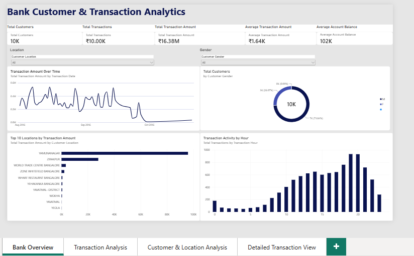
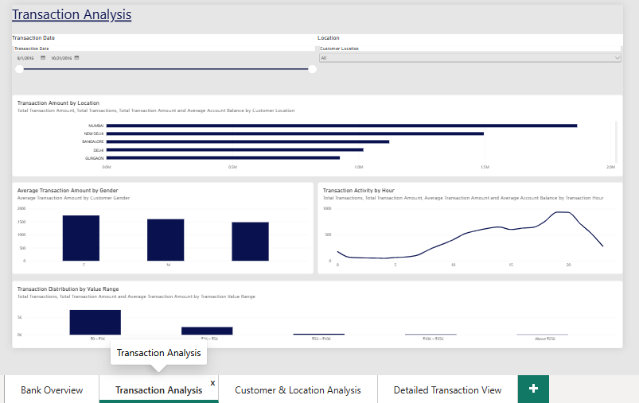
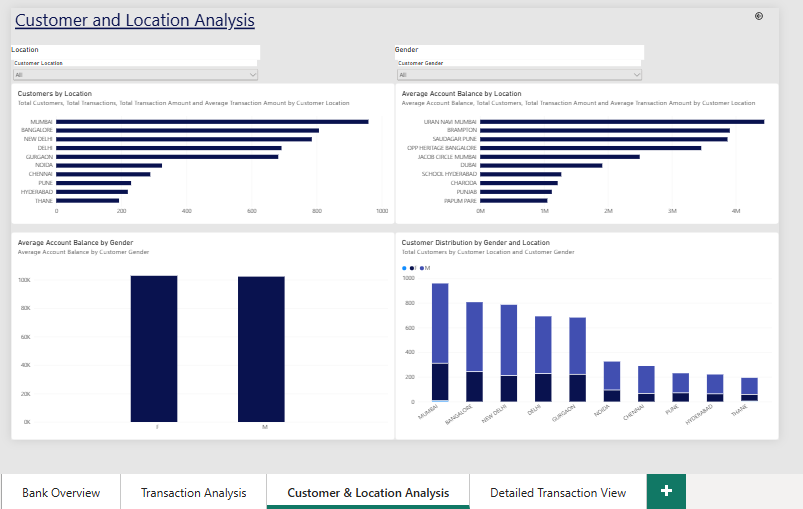
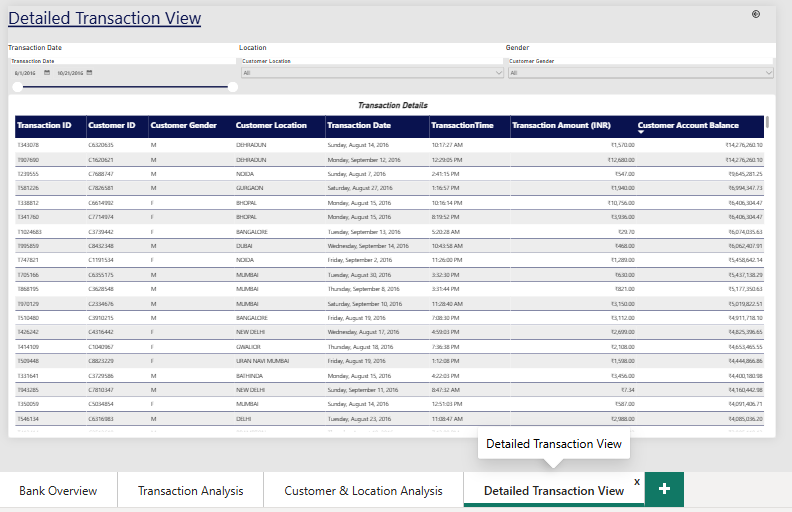

# Bank Customer & Transaction Analytics

This project presents an interactive Power BI dashboard developed to analyze banking customers and transaction activity. The dashboard provides insights into transaction amounts, customer distribution, account balances, transaction timing, geographical patterns, and transaction value ranges.

The dashboard transforms raw banking transaction data into an interactive analytical report using Power Query, DAX, and Power BI visualizations.


## Objectives

- Analyze overall customer and transaction activity.
- Examine transaction amounts across different locations.
- Identify patterns in transaction activity over time and across different hours.
- Compare transaction behavior across customer genders.
- Analyze customer distribution across locations.
- Examine average account balances across locations and genders.
- Categorize transactions based on transaction value.
- Provide a detailed transaction-level view for further analysis.
- Enable interactive filtering and drill-through analysis.


## Dataset

The project uses a banking transaction dataset containing customer, account, location, date, time, and transaction information.

A sample of 10,000 transaction records was selected for the Power BI implementation to maintain efficient dashboard performance while retaining sufficient data for analysis.

### Dataset Columns

| Column | Description |
|---|---|
| TransactionID | Unique identifier assigned to each transaction |
| CustomerID | Unique identifier assigned to each customer |
| CustGender | Gender of the customer |
| CustLocation | Location of the customer |
| CustAccountBalance | Customer account balance |
| TransactionDate | Date on which the transaction occurred |
| TransactionTime | Time at which the transaction occurred |
| TransactionAmount (INR) | Monetary value of the transaction in Indian Rupees |


## Data Preparation

The dataset was prepared using Power Query in Power BI before being loaded into the data model.

### Data Cleaning

- Removed the `CustomerDOB` column as it was not required for the dashboard analysis.
- Corrected the data type of `TransactionDate`.
- Converted `TransactionAmount (INR)` to a numeric data type.
- Checked the dataset for errors and missing values.
- Reviewed `CustAccountBalance` for missing values.
- Applied text-cleaning operations to location values.
- Standardized selected inconsistent location names.
- Verified column quality after transformation.

### Data Transformation

The original transaction time was stored as a numeric value in `HHMMSS` format. A custom transformation was applied to convert it into a proper Time data type.

A `Transaction Hour` calculated column was also created to support hour-based transaction analysis.

### Calculated Fields

```DAX
Transaction Hour =
HOUR(bank_transactions[TransactionTime])
```

Transactions were also grouped into predefined value ranges:

```DAX
Transaction Value Range =
SWITCH(
    TRUE(),
    bank_transactions[TransactionAmount (INR)] <= 1000, "₹0 – ₹1K",
    bank_transactions[TransactionAmount (INR)] <= 5000, "₹1K – ₹5K",
    bank_transactions[TransactionAmount (INR)] <= 10000, "₹5K – ₹10K",
    bank_transactions[TransactionAmount (INR)] <= 25000, "₹10K – ₹25K",
    "Above ₹25K"
)
```


## DAX Measures

### Total Transactions

```DAX
Total Transactions =
COUNTROWS(bank_transactions)
```

### Total Customers

```DAX
Total Customers =
DISTINCTCOUNT(bank_transactions[CustomerID])
```

### Total Transaction Amount

```DAX
Total Transaction Amount =
SUM(bank_transactions[TransactionAmount (INR)])
```

### Average Transaction Amount

```DAX
Average Transaction Amount =
AVERAGE(bank_transactions[TransactionAmount (INR)])
```

### Average Account Balance

```DAX
Average Account Balance =
AVERAGE(bank_transactions[CustAccountBalance])
```


# Dashboard Overview

The Power BI report consists of four interactive pages:

1. Bank Overview
2. Transaction Analysis
3. Customer & Location Analysis
4. Detailed Transaction View


## 1. Bank Overview

The Bank Overview page provides a high-level summary of the banking dataset and gives users an initial understanding of overall customer and transaction activity.

### KPIs

- Total Customers
- Total Transactions
- Total Transaction Amount
- Average Transaction Amount
- Average Account Balance

### Slicers / Interactive Filters

- Location
- Gender

### Charts and Visuals

1. **Transaction Amount Over Time** — A line chart showing how total transaction amount changes across transaction dates.
2. **Total Customers by Gender** — A donut chart showing the distribution of customers across gender categories.
3. **Top 10 Locations by Transaction Amount** — A bar chart identifying the locations with the highest transaction amounts.
4. **Transaction Activity by Hour** — A column chart showing the number of transactions recorded during different hours of the day.

### Dashboard Preview




## 2. Transaction Analysis

The Transaction Analysis page focuses on transaction behavior, transaction values, location-based activity, and time-based patterns.

### Slicers / Interactive Filters

- Transaction Date
- Location

### Charts and Visuals

1. **Transaction Amount by Location** - A bar chart comparing total transaction amounts across locations.
2. **Average Transaction Amount by Gender** - A clustered column chart comparing average transaction amounts across gender categories.
3. **Transaction Activity by Hour** - A line chart showing transaction activity across different hours.
4. **Transaction Distribution by Value Range** - A column chart categorizing transactions into predefined monetary ranges.

### Transaction Value Ranges

- ₹0 – ₹1K
- ₹1K – ₹5K
- ₹5K – ₹10K
- ₹10K – ₹25K
- Above ₹25K

### Dashboard Preview




## 3. Customer & Location Analysis

The Customer & Location Analysis page focuses on customer distribution, geographical patterns, and account balance characteristics.

### Slicers / Interactive Filters

- Location
- Gender

### Charts and Visuals

1. **Customers by Location** — A bar chart showing the locations with the highest number of customers.
2. **Average Account Balance by Location** — A bar chart comparing average account balances across locations.
3. **Average Account Balance by Gender** — A clustered column chart comparing average account balances across gender categories.
4. **Customer Distribution by Gender and Location** — A stacked column chart showing customer distribution by gender across locations.

### Drill-Through Functionality

The Customers by Location visual supports drill-through analysis to the Detailed Transaction View.

Users can select a location and navigate to the detailed transaction page to examine the corresponding transaction records.

### Dashboard Preview




## 4. Detailed Transaction View

The Detailed Transaction View provides a transaction-level representation of the dataset.

### Slicers / Interactive Filters

- Transaction Date
- Location
- Gender

### Transaction Details

- Transaction ID
- Customer ID
- Customer Gender
- Customer Location
- Transaction Date
- Transaction Time
- Transaction Amount
- Customer Account Balance

### Drill-Through

The page is configured as a drill-through destination using:

- Customer ID
- Customer Location

A Back button allows users to return to the previous dashboard page after performing a drill-through analysis.

### Dashboard Preview




# Dashboard Features

### Interactive Filtering

Slicers allow users to dynamically filter the dashboard based on location, gender, and transaction date.

### KPI Analysis

KPI cards provide a quick summary of the major banking metrics.

### Time-Based Analysis

Transaction activity can be analyzed by transaction date and hour of the day.

### Location-Based Analysis

The dashboard provides views of customer count, transaction amount, average account balance, and customer distribution across locations.

### Gender-Based Analysis

Customer and transaction characteristics can be compared across gender categories.

### Transaction Value Analysis

Transactions are divided into predefined monetary ranges to provide a clearer view of transaction distribution.

### Drill-Through Analysis

Users can move from summarized location-level analysis to detailed transaction records.


# Key Insights

The dashboard enables users to examine:

- Locations with comparatively higher transaction activity.
- Distribution of customers across different locations.
- Differences in average transaction amounts between gender categories.
- Variation in average account balances across locations.
- Transaction activity across different hours of the day.
- Distribution of transactions across different monetary value ranges.
- Relationship between customer distribution and transaction activity across locations.


# Conclusion

The Bank Customer & Transaction Analytics dashboard provides an interactive analytical view of customer and transaction data.

The project combines Power Query for data preparation, DAX for analytical calculations, and Power BI visualizations for presenting customer, transaction, location, time, and account-balance information.

The four-page dashboard allows users to move from a high-level overview to transaction analysis, customer and location analysis, and finally to individual transaction records through drill-through functionality.


# How to Use

1. Clone or download the repository.
2. Open `Bank_Customer_Transaction_Analytics.pbix` using Power BI Desktop.
3. Ensure that the dataset path is correctly configured if required.
4. Refresh the data if necessary.
5. Navigate through the four dashboard pages.
6. Use the available slicers to filter the analysis.
7. Use the drill-through functionality to investigate detailed transaction records.


# Project Structure

```text
Bank-Customer-Transaction-Analytics/
│
├── data/
│   └── bank_transactions.csv
│
├── images/
│   ├── bank_overview.png
│   ├── transaction_analysis.png
│   ├── customer_location_analysis.png
│   └── detailed_transaction_view.png
│
├── Bank_Customer_Transaction_Analytics.pbix
│
└── README.md
```


# Tools Used

- **Microsoft Power BI Desktop** — Dashboard development and visualization
- **Power Query** — Data cleaning and transformation
- **DAX** — Measures and calculated columns
- **CSV Dataset** — Source data
- **GitHub** — Project documentation and version control


# Author

**Mrinal Salian TYBSc Data Science Student**

**Email: mrinal.salian07@gmail.com**

**Linkedin: linkedin.com/in/mrinal-salian-35174136b**

Bank Customer & Transaction Analytics  
Power BI Project
